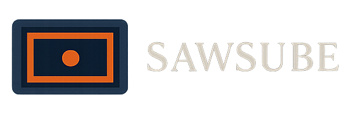
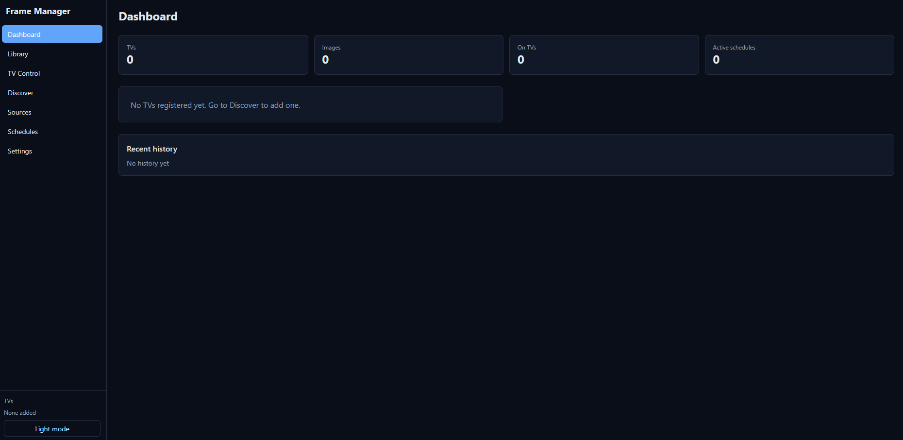
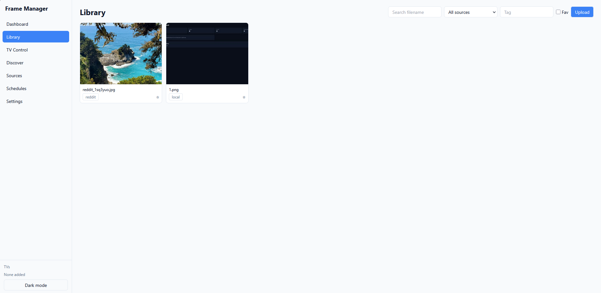
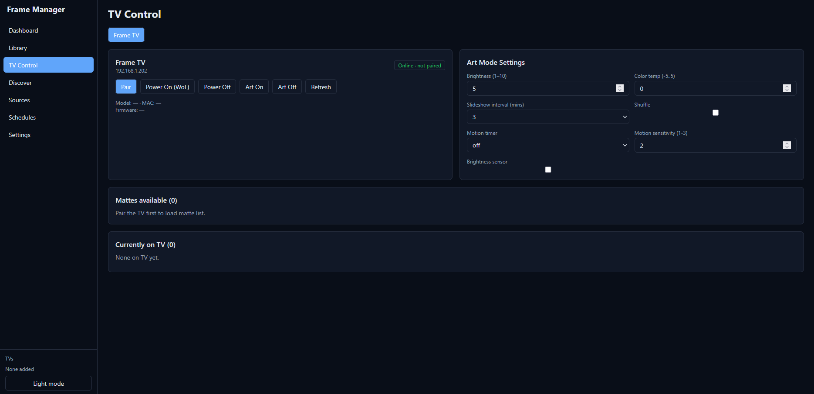
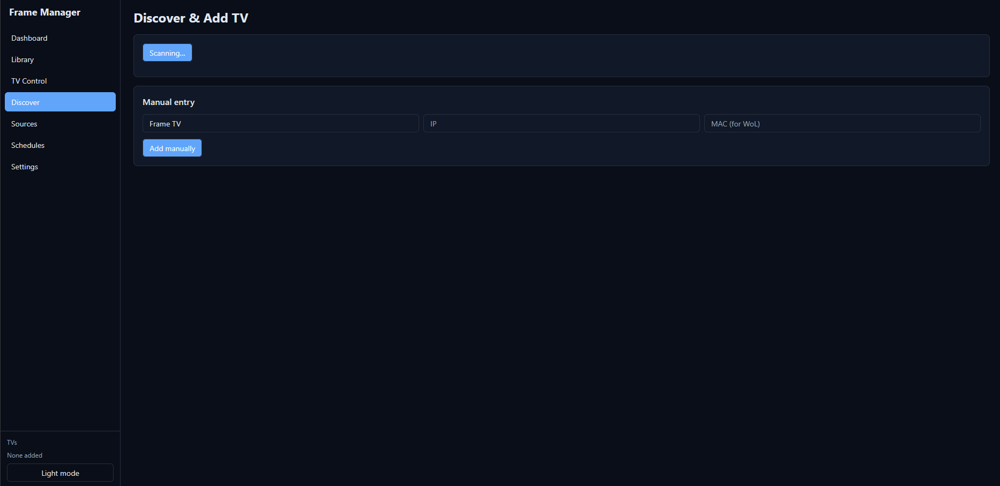
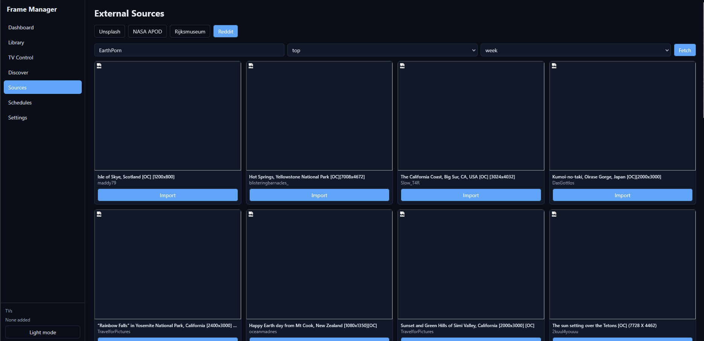
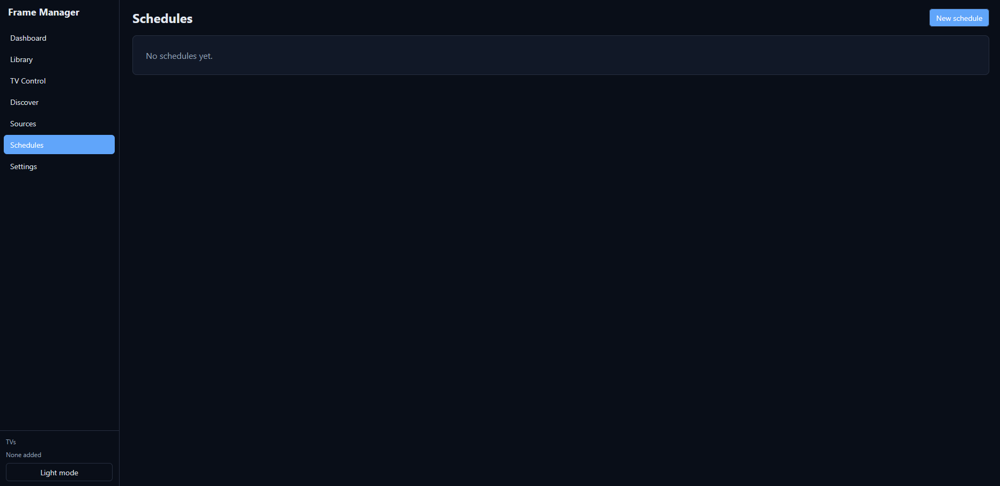
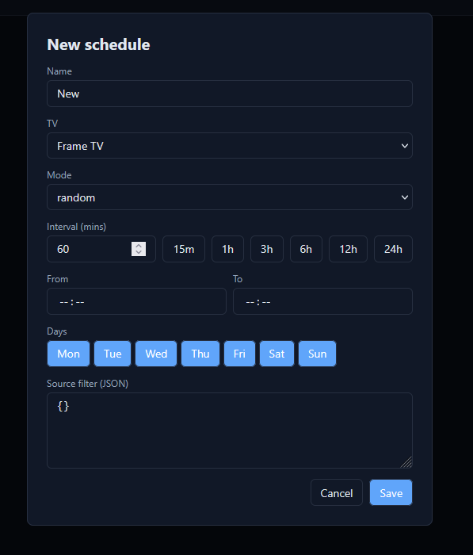
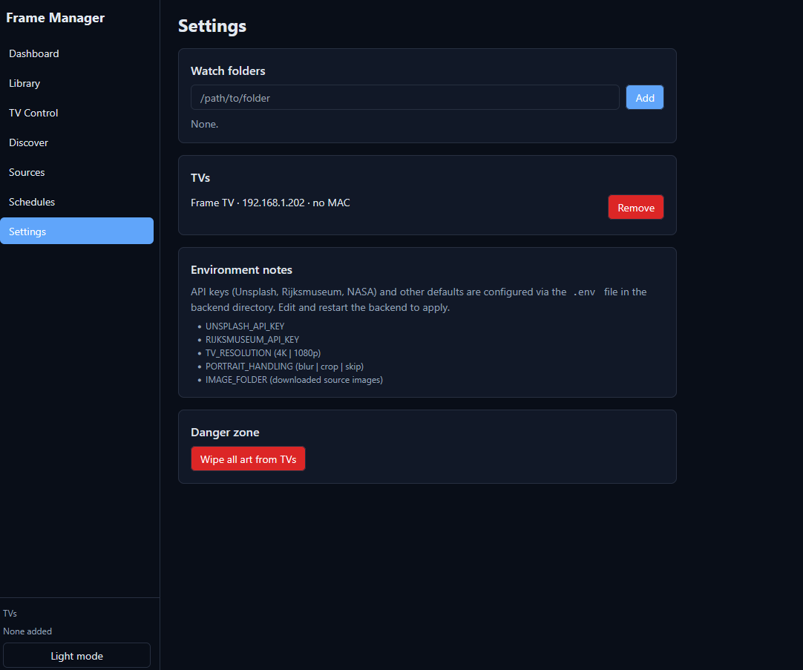
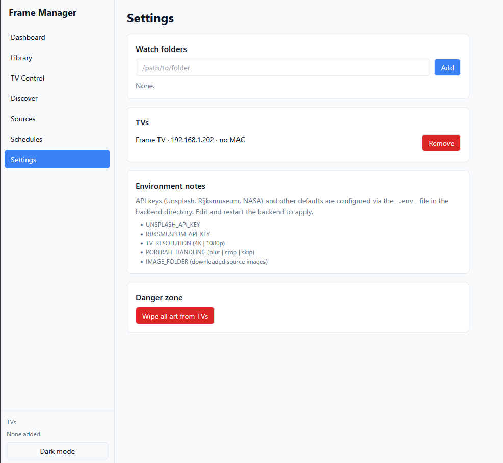

# SAWSUBE



> Your Frame. Your Art. Your Rules.

A self-hosted web application for managing art on your Samsung Frame TV —
upload your own images, schedule rotations, browse free art sources,
and control every Art Mode setting, all from your browser.
No Samsung account. No subscription. No cloud.

**Built by WB**



---

## Features

- **Multi-TV support** — manage multiple Frame TVs simultaneously, each with independent controls and schedules
- **Full Art Mode control** — brightness, colour temperature, slideshow interval, shuffle, motion timer, motion sensitivity, brightness sensor, matte/border style
- **Image library** — upload images via drag-and-drop or file picker, with SHA256 deduplication, tagging, favourites, and multi-select bulk actions
- **Intelligent image processing** — every image is automatically processed before upload:
  - EXIF orientation correction
  - ICC colour profile conversion to sRGB (critical — prevents washed-out colours on the Frame)
  - Portrait & square images get Instagram-style blur-fill (blurred, desaturated background, sharp image centred on top)
  - Landscape crop to 16:9 centred, then Lanczos resize to 3840×2160 (4K) or 1920×1080 (1080p)
  - Subtle unsharp mask to compensate for display softening
  - All EXIF metadata stripped from output
  - Results cached by hash — re-uploads skip reprocessing
- **Scheduling** — automated art rotation with random, sequential, or favourites-weighted modes; optional time-of-day windows and day-of-week filters
- **Folder watcher** — point it at a folder and new images appear in the library automatically
- **External sources** — browse and import from Unsplash, NASA Astronomy Picture of the Day, Rijksmuseum, and Reddit image posts
- **TV discovery** — UPnP/SSDP scan finds Frame TVs on your LAN automatically
- **Wake-on-LAN** — power on a TV by MAC address
- **Real-time updates** — WebSocket pushes live TV status, upload progress, and schedule fires to the UI without polling
- **Dark and light mode** — persists in browser storage
- **No authentication required** — designed for personal use on a trusted home network

---

## ☕ If This Saved You Money (or Sanity)

Building this took hundreds of hours. If it's saving you the cost of a Samsung subscription or simplifying your smart home setup, consider buying me a coffee:

<a href="https://buymeacoffee.com/succinctrecords"></a>

Every coffee helps fund development of open-source projects like this one.

---

## Requirements

| Requirement | Notes |
|---|---|
| Python 3.11+ | Backend runtime |
| Node.js 20+ | Only needed to build the frontend UI; without it the API still works |
| Samsung Frame TV (2021+) | Tested against LS03A, LS03B, LS03C, LS03D. Older models are best-effort |
| Same LAN as the TV | All communication is local — no internet required for TV control |

---

## Quick Start

### Option 1 — Docker (recommended)

Single command. Builds everything, runs everything.

```bash
cp .env.example .env          # copy config template
# edit .env if needed (TV IP, API keys, etc.)
docker compose up --build
```

Open **http://localhost:8000** in your browser.

> **Linux note:** For SSDP TV discovery and Wake-on-LAN to function correctly, uncomment `network_mode: host` in `docker-compose.yml`. This is required because multicast packets don't cross Docker's bridge network by default.

---

### Option 2 — Native on Windows

```cmd
start.bat
```

This will:
1. Create a Python virtual environment in `.venv` if one doesn't exist
2. Install all Python dependencies
3. Copy `.env.example` to `.env` if no `.env` is present
4. Build the React frontend with npm (if Node is installed)
5. Start the app at **http://localhost:8000**

---

### Option 3 — Native on Linux / Linux Mint / Mac

```bash
chmod +x start.sh
./start.sh
```

Same sequence as the Windows script. Tested on Linux Mint Debian Edition and standard Ubuntu.

---

## First-Time Setup

### 1. Configure your environment

Copy the example config and edit as needed:

```bash
cp .env.example .env
```

| Variable | Default | Description |
|---|---|---|
| `TV_DEFAULT_IP` | *(empty)* | Pre-fills the IP field when adding a TV manually |
| `IMAGE_FOLDER` | `./data/images` | Where downloaded source images are stored |
| `DB_PATH` | `./data/framemanager.db` | SQLite database path |
| `TOKEN_DIR` | `./data/tokens` | Pairing token files — **must persist across restarts** |
| `IMAGE_CACHE_DIR` | `./data/cache` | Processed 4K JPEG cache (keyed by file hash) |
| `THUMBNAIL_DIR` | `./data/thumbnails` | 400px-wide preview cache |
| `TV_RESOLUTION` | `4K` | Output resolution: `4K` (3840×2160) or `1080p` (1920×1080) |
| `PORTRAIT_HANDLING` | `blur` | How portrait/square images are handled: `blur` (recommended), `crop`, or `skip` |
| `UNSPLASH_API_KEY` | *(empty)* | Free key from [unsplash.com/developers](https://unsplash.com/developers) |
| `RIJKSMUSEUM_API_KEY` | *(empty)* | Free key from [data.rijksmuseum.nl](https://data.rijksmuseum.nl/object-metadata/api/) |
| `PORT` | `8000` | Port the backend listens on |
| `POLL_INTERVAL_SECS` | `20` | How often the backend polls each TV for status updates |

NASA APOD requires no API key (uses the public `DEMO_KEY` with rate limits; add your own free key at [api.nasa.gov](https://api.nasa.gov) for higher limits). Reddit requires no API key.

---

### 2. Add your TV

1. Open the app and go to **Discover**
2. Click **Scan Network** — the app sends a UPnP M-SEARCH multicast and lists any responding Samsung TVs
3. Click **Add** next to your Frame TV, or enter the IP manually if it didn't appear
4. Give it a friendly name (e.g. "Living Room")

> Make sure your TV has a **static IP address** (set this in your router's DHCP settings, not on the TV itself). A changing IP will break the connection.

---

### 3. Pair the TV

Pairing generates an access token that is stored locally and reused on every subsequent connection — you only need to do this once per TV.

1. Go to **TV Control**, select your TV, and click **Pair**
2. A prompt will appear on your TV screen — press **Allow** with your remote within 90 seconds
3. The token is saved to `data/tokens/tv_<id>.token`

If pairing fails or the token is rejected later, click **Pair** again and repeat the Allow step.

---

## Using the App

### Dashboard

Live overview of all TVs — online/offline status, Art Mode state, currently displayed image, recent history, and quick actions (Next Image, Art Mode On/Off).


### Library

Your full image collection. Supports:
- **Drag and drop** files anywhere on the page to upload
- Click **Upload** to use a file picker (multiple files supported)
- Filter by source, tag, or favourites
- Hover over an image for quick actions: send to a specific TV, delete, edit tags
- Multi-select mode for bulk operations (send all to TV, bulk delete, bulk tag)

All images are processed through the pipeline before being stored — what you see in thumbnails is after EXIF correction; what gets sent to the TV is the full 4K processed version.



### TV Control

Per-TV panel with:
- **Pair / connection status**
- **Power controls** — Wake-on-LAN (requires MAC address) and power off
- **Art Mode toggle** — switch in and out of Art Mode
- **Art Mode settings** — brightness, colour temperature, slideshow interval, shuffle, motion timer, motion sensitivity, brightness sensor. All applied live via the TV API
- **Matte selector** — lists all matte styles supported by your specific TV model. Click to apply
- **Currently on TV** — scrollable strip of all images stored on the TV. Click any to display it; hover for delete



### Discover

Scan the network for Frame TVs or add one manually by IP. Triggered on-demand, not continuous.



### Sources

Import images from external services:

| Source | API key needed | Notes |
|---|---|---|
| **Unsplash** | Yes (free) | Search by keyword; all results are landscape-oriented |
| **NASA APOD** | No | Today's Astronomy Picture of the Day (images only, not videos) |
| **Rijksmuseum** | Yes (free) | Public-domain artworks from the Dutch national museum |
| **Reddit** | No | Image posts from any public subreddit; top/hot/new, configurable time range |

Imported images go through the same processing pipeline and appear in your Library.



### Schedules

Automated art rotation. Each schedule belongs to a TV and runs on an APScheduler interval job:

- **Random** — picks a random eligible image each time
- **Sequential** — cycles through eligible images in order
- **Weighted** — random but favourites are picked 3× more often

Schedules support optional time windows (e.g. only run 08:00–23:00) and day-of-week filters. The **Source filter** JSON field lets you restrict which images are eligible (by source, tag, or favourites-only).

Use **Run Now** to test a schedule immediately without waiting for the interval.

  


### Settings

- Watch folders — add filesystem paths; new images are automatically ingested as they appear
- TV management — rename, change IP, remove
- Environment variable reference — documents where to set API keys and processing options
- Danger zone — wipe all art from TVs (local records kept)

  


---

## Repository Structure

```
WBs-samsung-frame-art/
├── backend/
│   ├── main.py                  # FastAPI app entry point + lifespan
│   ├── config.py                # Settings via pydantic-settings + .env
│   ├── database.py              # Async SQLAlchemy engine + session
│   ├── schemas.py               # Pydantic request/response models
│   ├── models/
│   │   ├── tv.py                # TV table
│   │   ├── image.py             # Image + TVImage tables
│   │   ├── schedule.py          # Schedule table
│   │   ├── history.py           # History table
│   │   └── folder.py            # WatchFolder + Setting tables
│   ├── routers/
│   │   ├── tv.py                # /api/tvs — TV management + discovery
│   │   ├── art.py               # /api/tvs/{id}/art — Art Mode controls
│   │   ├── images.py            # /api/images — library + upload + send to TV
│   │   ├── schedule.py          # /api/schedules
│   │   ├── sources.py           # /api/sources — folders + Unsplash/NASA/Rijks/Reddit
│   │   ├── meta.py              # /api/history + /api/stats
│   │   └── ws.py                # /ws WebSocket endpoint
│   ├── services/
│   │   ├── tv_manager.py        # Persistent connection pool + polling + TV operations
│   │   ├── image_processor.py   # Full image pipeline (Pillow)
│   │   ├── scheduler.py         # APScheduler wrapper
│   │   ├── watcher.py           # watchdog folder monitor
│   │   ├── discovery.py         # UPnP/SSDP scan
│   │   ├── ws_manager.py        # WebSocket broadcast hub
│   │   └── sources/
│   │       ├── common.py        # Shared download + register helper
│   │       ├── unsplash.py
│   │       ├── nasa_apod.py
│   │       ├── rijksmuseum.py
│   │       └── reddit.py
│   └── requirements.txt
├── frontend/
│   ├── src/
│   │   ├── App.tsx
│   │   ├── main.tsx
│   │   ├── index.css            # Tailwind + CSS variables (dark/light)
│   │   ├── lib/
│   │   │   ├── api.ts           # Typed fetch wrapper + shared types
│   │   │   ├── ws.ts            # WebSocket client with auto-reconnect
│   │   │   └── hooks.ts         # useWS, useToggleTheme
│   │   ├── components/
│   │   │   ├── Sidebar.tsx      # Nav + per-TV status dots
│   │   │   └── Toast.tsx        # Real-time toast notifications
│   │   └── pages/
│   │       ├── Dashboard.tsx
│   │       ├── Library.tsx
│   │       ├── TVControl.tsx
│   │       ├── Discover.tsx
│   │       ├── Sources.tsx
│   │       ├── Schedules.tsx
│   │       └── Settings.tsx
│   ├── package.json
│   ├── vite.config.ts
│   ├── tailwind.config.js
│   └── tsconfig.json
├── data/                        # Created at runtime — gitignored
│   ├── framemanager.db
│   ├── tokens/
│   ├── cache/
│   ├── thumbnails/
│   └── images/
├── docker-compose.yml
├── Dockerfile.backend           # Multi-stage: builds frontend + installs Python
├── start.bat                    # Windows launcher
├── start.sh                     # Linux/Mac launcher
├── .env.example
└── Dev_Spec.md                  # Full technical specification
```

---

## TV Communication

All TV communication goes through [NickWaterton's fork of samsung-tv-ws-api](https://github.com/NickWaterton/samsung-tv-ws-api), installed directly from GitHub:

```
samsungtvws[async,encrypted] @ git+https://github.com/NickWaterton/samsung-tv-ws-api.git
```

This is the most complete implementation of Samsung's Art Mode WebSocket API, supporting Frame models from 2016 to 2024.

The backend maintains a **persistent connection pool** — one WebSocket connection per TV, opened lazily on first use and kept alive. Connections are never opened per-request (doing so triggers the pairing prompt on every action). Each TV has its own async lock and exponential-backoff reconnect logic. Every TV call is wrapped in a try/except — an offline or unreachable TV will never crash the app.

Pairing tokens are saved to `data/tokens/` and reused across every restart. They survive Docker container rebuilds as long as the `data/` volume is mounted.

---

## What the API Can and Cannot Do

### Confirmed working via the local WebSocket API

- Upload custom images (JPEG, PNG) to Art Mode
- Select/display any uploaded image
- Delete uploaded images
- Get/set Art Mode on or off
- Get the currently displayed image
- List all images stored on the TV
- Get image thumbnails from the TV
- Set Art Mode brightness, colour temperature
- Set slideshow on/off, interval, shuffle/sequential
- Set matte/border style and colour
- Set motion sensor timer and sensitivity
- Set brightness sensor on/off
- Wake-on-LAN (power on via MAC address)
- Power off (key command)
- Get device info (model, firmware, name)

### Not possible via the local API

- Samsung Art Store content (DRM — only accessible to subscribers via Samsung's cloud)
- Anything Bixby/ambient routines control
- Setting mattes on images uploaded via USB
- Firmware updates
- Screen brightness in regular TV mode (only Art Mode brightness is accessible)
- Physical power button behaviour

---

## Troubleshooting

**TV not found by SSDP scan**
- Verify the TV is on and on the same network segment as the machine running Frame Manager
- Try adding it manually by IP instead
- On Docker/Linux, ensure `network_mode: host` is set in `docker-compose.yml`
- Confirm the TV responds at `http://YOUR_TV_IP:8001/api/v2/` in a browser

**Pairing prompt doesn't appear**
- The TV must be powered on and not in standby
- Only one pairing attempt can be in-flight at a time — wait for timeout before retrying
- Some routers block WebSocket connections on port 8002; check firewall rules

**Images look washed out on the TV**
- This happens when source images use Adobe RGB or ProPhoto colour profiles and aren't converted to sRGB before upload
- The image processor handles this automatically for images uploaded through the app
- If you're seeing it, the source image may have had an unrecognised ICC profile — check the app logs for ICC conversion warnings

**Art Mode settings not applying**
- The TV must be paired and online
- Some settings (e.g. `set_slideshow_status`) vary in parameter shape across TV firmware versions — check the app logs if a setting silently fails

**Schedules not firing**
- Check the schedule is marked **active**
- Verify the time window and days-of-week settings aren't excluding the current time
- Use **Run Now** to test immediately
- Check the backend logs for APScheduler output

---

## Tech Stack

| Layer | Technology |
|---|---|
| Backend | FastAPI (Python 3.11+), async |
| TV communication | NickWaterton/samsung-tv-ws-api |
| Database | SQLite via SQLAlchemy 2.0 (async) |
| Image processing | Pillow |
| Scheduling | APScheduler 3.x (AsyncIOScheduler) |
| File watching | watchdog |
| Frontend | React 18 + Vite + TypeScript |
| Styling | Tailwind CSS |
| Real-time | FastAPI WebSockets |
| Packaging | Docker + Docker Compose |
| HTTP client | httpx (async, for external source APIs) |

---

## License

Personal use / self-hosted. No affiliation with Samsung.
